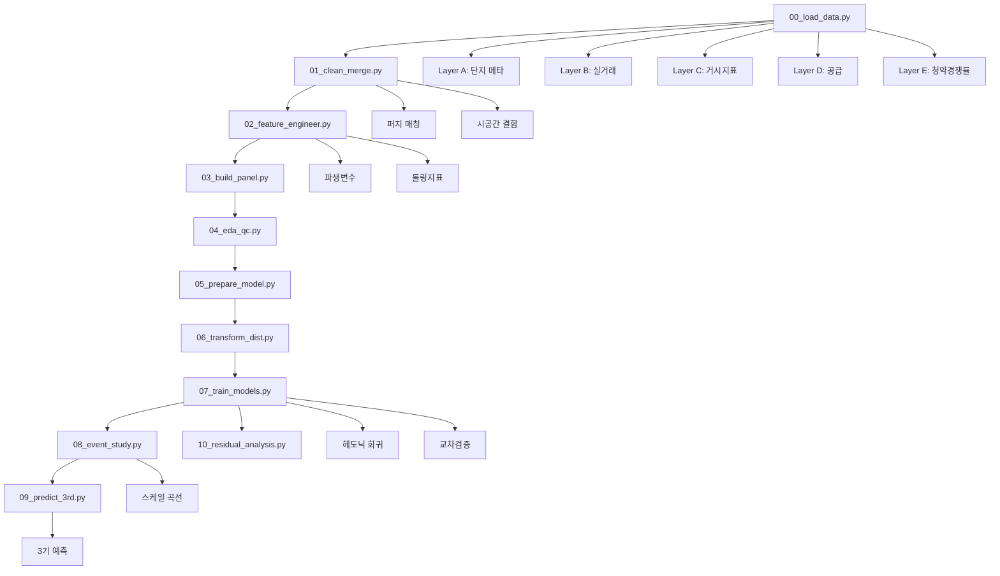

# Analysis Scripts Documentation

본 문서는 `/script` 디렉토리에 위치한 데이터 분석 파이프라인 스크립트들에 대한 상세한 설명을 제공합니다. 이 스크립트들은 헤도닉 가격 모델링을 통한 아파트 가격 분석과 예측을 수행하는 완전한 분석 워크플로우를 구성합니다.

## 📁 파일 개요

| 순서 | 파일명 | 목적 | 주요 기능 |
|------|--------|------|-----------|
| 00 | `00_load_data.py` | 원시 데이터 로드 | 레이어별 데이터 분류 및 로드 |
| 01 | `01_clean_merge.py` | 데이터 정제 및 병합 | 퍼지 매칭, 시공간 결합 |
| 02 | `02_feature_engineer.py` | 피처 엔지니어링 | 파생 변수 생성, 롤링 지표 |
| 03 | `03_build_panel.py` | 패널 데이터 구축 | 시간-단지 인덱스 설정 |
| 04 | `04_eda_qc.py` | 탐색적 분석 | 품질 관리, 시각화 |
| 05 | `05_prepare_model.py` | 모델 준비 | 불필요 변수 제거 |
| 06 | `06_transform_dist.py` | 분포 변환 | Yeo-Johnson 변환 |
| 07 | `07_train_models.py` | 모델 훈련 | 헤도닉 회귀, 교차검증 |
| 08 | `08_event_study.py` | 이벤트 스터디 | 가격 스케일 곡선 분석 |
| 09 | `09_predict_3rd.py` | 3기 예측 | 미래 가격 예측 |
| 10 | `10_residual_analysis.py` | 잔차 분석 | 모델 진단 |

---

## 🔧 상세 스크립트 분석

### 1. `00_load_data.py` - 원시 데이터 로드

**목적**: 다양한 형태의 원시 CSV 데이터를 분석 목적에 따라 5개 레이어로 분류하여 로드

**주요 로직**:
```python
# 레이어 구성 정의
LAYER_CONFIG = {
    "A": {
        "desc": "단지 메타 (1·2·3기)",
        "pattern": "아파트_매매/**/*06_24/*.csv|아파트_매매/한국부동산원_공동주택 단지 식별정보_기본정보_*.csv",
        "outfile": "layer_A_complex_meta",
    },
    "B": {
        "desc": "실거래 기록 (1·2기)",
        "pattern": "transactions/*거래*.csv|아파트_매매/**/*실거래가*.csv",
        "outfile": "layer_B_transactions",
    },
    "C": {
        "desc": "시장 지수·거시 변수",
        "pattern": "transactions/*가격지수*.csv|else/*.csv",
        "outfile": "layer_C_macro_index",
    },
    "D": {
        "desc": "공급 (미분양·입주 예정)",
        "pattern": "supply/*.csv",
        "outfile": "layer_D_supply",
    },
    "E": {
        "desc": "청약 경쟁률",
        "pattern": "competition/*.csv",
        "outfile": "layer_E_competition",
    },
}

def _load_layer(layer: str, base_dir: Path) -> pd.DataFrame:
    cfg = LAYER_CONFIG[layer]
    files = _collect_files(base_dir, cfg["pattern"])
    
    # 레이어별 특수 처리
    if layer == "A":
        # 실거래 파일 제외, 메타 데이터만
        files = [f for f in files if '실거래' not in f.name]
        
        # 동적 헤더 감지
        for f in files:
            header_row = 0
            with f.open('r', encoding='cp949', errors='ignore') as fin:
                for i, line in enumerate(fin):
                    if '단지코드' in line and '단지명' in line:
                        header_row = i
                        break
            
            df = pd.read_csv(f, skiprows=header_row, header=0, encoding="cp949")
            
            # 컬럼명 통일
            for src in ["단지명","complex","단지"]:
                if src in df.columns:
                    df.rename(columns={src: "complex_name"}, inplace=True)
            
            if "단지코드" in df.columns:
                df.rename(columns={"단지코드": "complex_id"}, inplace=True)
    
    elif layer == "B":
        # 실거래 데이터 처리
        for f in files:
            header_row = 0
            with f.open('r', encoding='cp949', errors='ignore') as fin:
                for i, line in enumerate(fin):
                    if line.lstrip().startswith('NO'):
                        header_row = i
                        break
            
            df = pd.read_csv(f, skiprows=header_row, header=0, encoding="cp949")
            
            # 컬럼명 통일
            for src in ["단지명","complex","단지"]:
                if src in df.columns:
                    df.rename(columns={src: "complex_name"}, inplace=True)
```

**핵심 기능**:
- 글로브 패턴 기반 파일 수집
- 레이어별 맞춤 전처리
- 동적 헤더 감지
- 강건한 인코딩 처리
- 컬럼명 표준화

---

### 2. `01_clean_merge.py` - 데이터 정제 및 병합

**목적**: 로드된 레이어들을 정제하고 퍼지 매칭을 통해 단지별-시점별 패널 데이터로 병합

**주요 로직**:
```python
# 날짜 전처리
def _prep_date(df, col):
    df[col] = pd.to_datetime(df[col])
    df["year_month"] = df[col].dt.to_period("M").dt.to_timestamp()
    return df

# 공간 매핑: 거래 B → 단지 A
def normalize(x):
    if pd.notna(x):
        s = x.lower()
        s = re.sub(r"\(.*?\)", "", s)  # 괄호 제거
        s = s.replace("아파트", "")     # '아파트' 제거
        s = re.sub(r"[\s\-\.\(\)]", "", s)  # 특수문자 제거
        return s
    return ""

# 퍼지 매칭
unmapped_norm = nomap.loc[nomap["complex_id"].isna(), "complex_norm"].dropna().unique()
if len(unmapped_norm):
    # 블록 기반 후보군 축소
    block_map = {}
    for norm_key, cid in name_dict_norm.items():
        blk = norm_key[:2]  # 첫 2글자로 블록 생성
        block_map.setdefault(blk, []).append(norm_key)
    
    matches = {}
    for norm_val in tqdm(unmapped_norm, desc="fuzzy matching by block"):
        blk = norm_val[:2]
        choices = block_map.get(blk, list(name_dict_norm.keys()))
        threshold = 90 if len(norm_val) > 4 else 85
        match = process.extractOne(norm_val, choices, scorer=fuzz.ratio)
        matches[norm_val] = name_dict_norm.get(match[0]) if match and match[1] >= threshold else np.nan

# Wide → Long 변환 (C 레이어)
date_pattern = re.compile(r"^\d{4}(?:\.\d+)?(?:/2)?(?:년)?$")
date_cols = [c for c in C_wide.columns if date_pattern.match(c)]
id_vars = [c for c in C_wide.columns if c not in date_cols]
C = C_wide.melt(id_vars=id_vars, value_vars=date_cols,
                var_name="year_month_raw", value_name="macro_index")

def parse_ym(s):
    s2 = s.replace("/2", "").replace("년", "")
    return pd.to_datetime(s2, format="%Y.%m", errors="coerce")

C["year_month"] = C["year_month_raw"].apply(parse_ym)
```

**핵심 기능**:
- 퍼지 매칭을 통한 단지명 매핑
- 블록 기반 매칭 성능 최적화
- Wide-to-Long 데이터 변환
- 시공간 결합 (complex_id + year_month)
- 수동 매핑 테이블 지원

---

### 3. `02_feature_engineer.py` - 피처 엔지니어링

**목적**: 헤도닉 모델링을 위한 파생 변수 생성 및 롤링 지표 계산

**주요 로직**:
```python
# 파생 가격 변수
df["price_per_m2"] = df["price"] / df["area_m2"]
df["ln_price"] = np.log(df["price_per_m2"].clip(lower=args.min_clip))

# 건축 연차
if {"built_year","contract_year"}.issubset(df.columns):
    df["built_age"] = df["contract_year"] - df["built_year"]
    
    # built_year 결측 치환 (단지별 평균)
    mean_by_cx = df.groupby("complex_id")["built_year"].transform("mean")
    df.loc[df["built_year"].isna(), "built_year"] = mean_by_cx
    df["built_age"] = df["contract_year"] - df["built_year"]

# 지역 더미 (시군구 고정 효과)
if args.sparse_dummies:
    dummies = pd.get_dummies(df["시군구명"], prefix="reg", dtype="int8", sparse=True)
else:
    dummies = pd.get_dummies(df["시군구명"], prefix="reg", dtype="int8")
df = pd.concat([df, dummies], axis=1)

# 공급 쇼크: 미분양 12개월 누적
df.sort_values(["시군구명","year_month"], inplace=True)
if "unsold_units" in df.columns:
    df[f"unsold_units_{args.roll_window_supply}m"] = (
        df.groupby("시군구명")["unsold_units"]
          .transform(lambda s: s.fillna(0).rolling(window=args.roll_window_supply, min_periods=1).sum())
    )

# 청약 과열: 경쟁률 3개월 MA
if "comp_rate" in df.columns:
    df[f"comp_rate_ma{args.roll_window_demand}"] = (
        df.groupby("시군구명")["comp_rate"]
          .transform(lambda s: s.ffill().rolling(window=args.roll_window_demand, min_periods=1).mean())
    )

# 결측 처리: 단지/지역 단위 평균 대체
for col in num_cols:
    if df[col].isna().any():
        df[col] = df.groupby("complex_id")[col].transform(lambda s: s.fillna(s.mean()))
        df[col] = df.groupby("시군구명")[col].transform(lambda s: s.fillna(s.mean()))
```

**핵심 기능**:
- 로그 가격 변환
- 건축 연차 계산
- 지역 고정 효과 더미
- 롤링 윈도우 지표
- 계층적 결측값 처리

---

### 4. `03_build_panel.py` - 패널 데이터 구축

**목적**: 헤도닉 모델링을 위한 표준 패널 데이터 구조 생성

**주요 로직**:
```python
# 시간 식별자 생성
df["year_month"] = pd.to_datetime(df["year_month"])
df["time_id"] = df["year_month"].dt.year * 100 + df["year_month"].dt.month

# 시점 고정 효과 더미 생성 (선택사항)
if args.add_time_dummies:
    dummies = pd.get_dummies(
        df["time_id"],
        prefix=args.time_dummy_prefix,
        dtype="int8",
        sparse=args.sparse_dummies
    )
    
    # Parquet 호환성을 위한 dense 변환
    if args.sparse_dummies:
        dummies = dummies.sparse.to_dense()
    
    df = pd.concat([df, dummies], axis=1)

# 멀티인덱스 설정 및 중복 제거
df.set_index(["complex_id", "year_month"], inplace=True)
df = df[~df.index.duplicated(keep="first")]
```

**핵심 기능**:
- 시간 ID 생성
- 시점 고정 효과 더미
- 멀티인덱스 설정
- 중복 레코드 제거
- Parquet 최적화

---

### 5. `04_eda_qc.py` - 탐색적 데이터 분석 및 품질 관리

**목적**: 모델링 전 데이터 품질 검증 및 통계적 특성 분석

**주요 로직**:
```python
# 결측률 분석
missing_rate = df[num_cols].isna().mean().sort_values(ascending=False)
missing_rate.to_csv(OUT_DIR / "qc_missing_rate.csv")

# 정규성 검사 (Shapiro-Wilk)
qc_norm = []
for col in ["price_per_m2", "ln_price", "built_age", "unsold_units_12m", "comp_rate_ma3"]:
    if col in df:
        series = df[col].dropna()
        # 표본이 5000개 이상일 경우 샘플링
        samp = series if len(series)<=5000 else series.sample(5000, random_state=0)
        stat, pval = stats.shapiro(samp)
        
        # Box-Cox 변환 람다 계산
        if (series>0).all():
            bc_data, bc_lambda = stats.boxcox(series)
        else:
            bc_lambda = np.nan
        
        qc_norm.append({
            "feature": col,
            "n": len(series),
            "shapiro_p": pval,
            "boxcox_lambda": bc_lambda
        })

# 다중공선성 (VIF) 계산
X = df[num_cols].dropna().iloc[:5000]
X = X.assign(const=1.0)
for i, col in enumerate(X.columns):
    if col != "const":
        vif = variance_inflation_factor(X.values, i)
        vif_df.loc[len(vif_df)] = [col, vif]

# 상관관계 히트맵
corr = df[num_cols].corr().abs()
top_feats = missing_rate.head(20).index.tolist()
sub_corr = corr.loc[top_feats, top_feats]

plt.figure(figsize=(8,6))
plt.imshow(sub_corr, vmin=0, vmax=1, cmap="viridis")
plt.colorbar(label="|Correlation|")
plt.title("Correlation Heatmap (Top 20 by Missing Rate)")
plt.savefig(OUT_DIR / "fig_corr_heatmap.png", dpi=150)
```

**핵심 기능**:
- 결측률 분석 및 시각화
- 정규성 검정
- Box-Cox 변환 람다 계산
- VIF 다중공선성 검사
- 상관관계 히트맵

---

### 6. `05_prepare_model.py` - 모델링용 데이터 준비

**목적**: 헤도닉 회귀 모델링에 불필요한 변수 제거 및 최종 데이터셋 준비

**주요 로직**:
```python
# 데이터 로드 및 백업
df = pd.read_parquet(IN_PATH)
df.to_parquet(BACKUP_PATH, index=False)

# 불필요 컬럼 제거
drop_cols = ["no"]  # ID 컬럼
drop_cols += ["contract_day", "contract_ym", "contract_year", "time_id"]  # 날짜 관련
drop_cols += [c for c in df.columns if str(c).startswith("tm_")]  # 시간 더미

df_model = df.drop(columns=drop_cols, errors="ignore")
df_model.to_parquet(OUT_PATH, index=False)
```

**핵심 기능**:
- 원본 데이터 백업
- ID 및 중복 시간 변수 제거
- 모델링 최적화
- 간결한 피처셋 생성

---

### 7. `06_transform_dist.py` - 분포 변환

**목적**: 헤도닉 회귀의 정규성 가정을 만족하기 위한 Yeo-Johnson 변환 적용

**주요 로직**:
```python
# 변환 대상 피처
features = ["price_per_m2", "ln_price"]
lambdas = {}
bounds = {}

for feat in features:
    if feat not in df.columns:
        continue
    
    series = df[feat].dropna()
    
    # Yeo-Johnson 변환
    yj_data, lam = yeojohnson(series)
    lambdas[feat] = lam
    col_yj = f"yj_{feat}"
    df[col_yj] = np.nan
    df.loc[series.index, col_yj] = yj_data
    
    # 윈저라이즈 (1% 하/상위 절단)
    lower = np.nanpercentile(df[col_yj], 1)
    upper = np.nanpercentile(df[col_yj], 99)
    bounds[feat] = (lower, upper)
    col_w = f"{col_yj}_w"
    df[col_w] = df[col_yj].clip(lower, upper)
    
    # 진단 플롯 생성
    for col in [feat, col_yj, col_w]:
        data = df[col].dropna()
        
        # 히스토그램
        plt.figure(figsize=(6,4))
        plt.hist(data, bins=50)
        plt.title(f"Histogram of {col}")
        plt.savefig(PLOT_DIR / f"fig_hist_{col}.png", dpi=150)
        plt.close()
        
        # QQ-플롯
        plt.figure(figsize=(6,6))
        sm.qqplot(data, line="45", fit=True)
        plt.title(f"QQ-plot of {col}")
        plt.savefig(PLOT_DIR / f"fig_qq_{col}.png", dpi=150)
        plt.close()
```

**핵심 기능**:
- Yeo-Johnson 변환
- 이상치 윈저라이징
- 변환 전후 진단 플롯
- 람다 파라미터 저장

---

### 8. `07_train_models.py` - 헤도닉 회귀 모델 훈련

**목적**: 교차검증을 통한 헤도닉 가격 모델 훈련 및 성능 평가

**주요 로직**:
```python
# 특성 및 타겟 설정
target = args.target  # "ln_price"
numeric_cols = [c for c in df.columns if is_numeric_dtype(df[c])]
features = [c for c in numeric_cols if c != target]
X = df[features]
y = df[target]

# 교차검증 설정
kf = KFold(n_splits=args.n_folds, shuffle=True, random_state=0)
metrics = []
coef_list = []
y_true_all = []
y_pred_all = []

# CV 수행
for fold, (train_idx, test_idx) in enumerate(kf.split(X), start=1):
    X_train = X.iloc[train_idx]
    X_test = X.iloc[test_idx]
    y_train = y.iloc[train_idx]
    y_test = y.iloc[test_idx]
    
    # 상수항 추가
    X_train_sm = sm.add_constant(X_train)
    X_test_sm = sm.add_constant(X_test)
    
    # 헤도닉 회귀 (강건 표준오차)
    model = sm.OLS(y_train, X_train_sm).fit(cov_type='HC3')
    
    # 예측 및 평가
    y_pred = model.predict(X_test_sm)
    r2 = r2_score(y_test, y_pred)
    
    # 원래 가격 공간에서 MAPE 계산
    true_price = np.exp(y_test)
    pred_price = np.exp(y_pred)
    mape = mean_absolute_percentage_error(true_price, pred_price)
    
    metrics.append({"fold": fold, "r2": r2, "mape": mape})
    
    # 회귀계수 저장
    params = model.params.reset_index()
    params.columns = ['feature', 'coef']
    params['fold'] = fold
    coef_list.append(params)

# 결과 저장 및 시각화
metrics_df = pd.DataFrame(metrics)
coef_df = pd.concat(coef_list, ignore_index=True)
coef_mean_df = coef_df.groupby('feature')['coef'].mean().reset_index()

# 회귀계수 시각화
coef_mean = coef_df.groupby('feature')['coef'].mean().abs().sort_values(ascending=False).head(args.top_coef)
plt.figure(figsize=(8,6))
coef_mean.sort_values().plot(kind='barh')
plt.title('Top Regression Coefficients (abs mean)')
plt.savefig(OUT_DIR/"fig_coef.png", dpi=150)

# 예측 vs 실제 시각화
plt.figure(figsize=(6,6))
plt.scatter(y_true_all, y_pred_all, alpha=0.3)
lims = [min(min(y_true_all), min(y_pred_all)), max(max(y_true_all), max(y_pred_all))]
plt.plot(lims, lims, 'k--')
plt.xlabel('True Price_per_m2')
plt.ylabel('Predicted Price_per_m2')
plt.title('Predicted vs True')
plt.savefig(OUT_DIR/"fig_pred_vs_true.png", dpi=150)
```

**핵심 기능**:
- K-Fold 교차검증
- 강건 표준오차 (HC3)
- R² 및 MAPE 평가
- 회귀계수 평균화
- 예측 성능 시각화

---

### 9. `08_event_study.py` - 이벤트 스터디 분석

**목적**: 단지별 입주 시점을 기준으로 한 가격 변화 패턴(스케일 곡선) 분석

**주요 로직**:
```python
# 데이터 로드 및 타입 통일
df = pd.read_parquet(args.panel_feat)
df['complex_id'] = df['complex_id'].astype(str).str.replace(r"\.0$", "", regex=True)
meta = pd.read_pickle(args.meta_a)
meta['complex_id'] = meta['complex_id'].astype(str)

# 예상 입주일 파싱
date_cols = [c for c in meta.columns if '승인' in c or '입주' in c]
exp_col = date_cols[0]
meta['expected_date'] = pd.to_datetime(meta[exp_col], errors='coerce')
meta['expected_ym'] = meta['expected_date'].dt.to_period('M').dt.to_timestamp()

# 패널과 메타 병합
df = df.merge(meta[['complex_id','expected_ym']], on='complex_id', how='left')

# tau 계산 (입주 시점 대비 상대적 시점)
df['year_month'] = pd.to_datetime(df['year_month'])
df['tau'] = (df['year_month'].dt.year*12 + df['year_month'].dt.month) - \
            (df['expected_ym'].dt.year*12 + df['expected_ym'].dt.month)

# tau 범위 필터링
df = df[(df['tau'] >= args.tau_min) & (df['tau'] <= args.tau_max)]

# tau별 평균 가격 집계
agg = df.groupby('tau')['price_per_m2'].mean().reset_index(name='raw_mean_price')

# LOWESS 스무딩
tau = agg['tau'].values
raw = agg['raw_mean_price'].values
smoothed = lowess(raw, tau, frac=args.frac, return_sorted=True)
agg['smoothed_price'] = np.interp(tau, smoothed[:,0], smoothed[:,1])

# 시각화
plt.figure(figsize=(8,4))
plt.plot(agg['tau'], agg['raw_mean_price'], color='gray', label='Raw mean')
plt.plot(agg['tau'], agg['smoothed_price'], color='red', label='LOWESS smoothed')
plt.xlabel('사건 시점(tau 개월)')
plt.ylabel('평균 평당 가격')
plt.title('사건 연구: 가격 vs tau')
plt.legend()
plt.savefig(args.output_fig, dpi=150)
```

**핵심 기능**:
- 상대적 시점(tau) 계산
- 이벤트 스터디 집계
- LOWESS 스무딩
- 가격 스케일 곡선 생성

---

### 10. `09_predict_3rd.py` - 3기 가격 예측

**목적**: 헤도닉 모델과 스케일 곡선을 결합하여 3기 단지의 미래 가격 예측

**주요 로직**:
```python
# 데이터 로드
panel_trans = pd.read_parquet(args.panel)  # 변환된 패널
panel_base = pd.read_parquet("output/panel_panel.parquet")  # 인덱스 정보
panel_base = panel_base.reset_index()

# 인덱스 결합
panel = pd.concat([panel_base[['complex_id','year_month']], 
                   panel_trans.reset_index(drop=True)], axis=1)

# 메타 및 회귀계수 로드
meta = pd.read_pickle(args.meta_a)
coef_df = pd.read_csv(args.model_coef)
scale_df = pd.read_csv(args.scale_curve)

# 회귀계수 및 스케일 곡선 준비
coef_series = coef_df.set_index('feature')['coef']
scale_map = scale_df.set_index('tau')['smoothed_price'].to_dict()
f0 = scale_map.get(0, 1.0)  # 기준점 (tau=0)

# 출시 시점 메타 처리
meta['launch_date'] = pd.to_datetime(meta[args.launch_date_col], errors='coerce')
meta['launch_ym'] = meta['launch_date'].dt.to_period('M').dt.to_timestamp()

# 출시 시점 패널 피처 병합
df = panel.merge(meta[['complex_id','complex_name','launch_ym']], on='complex_id', how='inner')
df_launch = df[df['year_month'] == df['launch_ym']].copy()

# 기본 로그 가격 예측
feature_cols = [c for c in coef_series.index if c != 'const']
X = df_launch[feature_cols]
X_sm = sm.add_constant(X)
base_ln = X_sm.dot(coef_series)
df_launch['base_price'] = np.exp(base_ln)

# 향후 tau별 가격 예측
taus = [int(t) for t in args.tau_list.split(',')]
for tau in taus:
    f_tau = scale_map.get(tau, np.nan)
    df_launch[f'price_tau{tau}'] = df_launch['base_price'] * (f_tau / f0)

# 결과 저장 및 시각화
out_cols = ['complex_id','complex_name','launch_ym','base_price'] + \
           [f'price_tau{t}' for t in taus]
df_launch[out_cols].to_csv(args.output_csv, index=False)

# tau별 평균 가격 시각화
mean_prices = df_launch[['base_price'] + [f'price_tau{t}' for t in taus]].mean()
plt.figure(figsize=(6,4))
mean_prices.plot(kind='bar')
plt.ylabel('Predicted price per m2')
plt.title('Predicted price at launch and future tau')
plt.savefig(args.output_fig, dpi=150)
```

**핵심 기능**:
- 헤도닉 모델 기본 예측
- 스케일 곡선 조정
- 다중 시점 예측
- 결과 시각화

---

### 11. `10_residual_analysis.py` - 잔차 분석

**목적**: 헤도닉 모델의 잔차 패턴 분석을 통한 모델 진단 및 개선점 도출

**주요 로직**:
```python
# 데이터 및 회귀계수 로드
df = pd.read_parquet(PANEL_PATH)
coef_df = pd.read_csv(COEF_PATH)
coef_series = coef_df.set_index('feature')['coef']

# 피처 행렬 준비
target = 'ln_price'
feature_cols = [f for f in coef_series.index if f != 'const' and f in df.columns]
X = df[feature_cols]
X_sm = sm.add_constant(X)

# 예측값 계산
y_true = df[target]
X_sm = X_sm.reindex(columns=coef_series.index, fill_value=0)  # 누락 컬럼 처리
y_pred = X_sm.dot(coef_series)

# 잔차 계산
df_res = pd.DataFrame({
    'year_month': pd.to_datetime(df['year_month']),
    'residual': y_true - y_pred
})

# 월별 평균 잔차 및 이동평균
res_ts = df_res.groupby('year_month')['residual'].mean().reset_index()
res_ts['residual_roll_mean'] = res_ts['residual'].rolling(
    window=args.rolling_window, min_periods=1).mean()

# 잔차 히스토그램
plt.figure(figsize=(6,4))
plt.hist(df_res['residual'].dropna(), bins=50, color='skyblue', edgecolor='k')
plt.title('Histogram of Residuals')
plt.xlabel('Residual (log price)')
plt.ylabel('Count')
plt.savefig(OUT_DIR / 'fig_residual_hist.png', dpi=150)

# 잔차 QQ-플롯
gg = sm.qqplot(df_res['residual'].dropna(), line='45', fit=True)
gg.figure.set_size_inches(6,6)
gg.figure.savefig(OUT_DIR / 'fig_residual_qq.png', dpi=150)

# 잔차 시계열 추세
plt.figure(figsize=(8,4))
plt.plot(res_ts['year_month'], res_ts['residual'], label='Mean Residual', alpha=0.6)
plt.plot(res_ts['year_month'], res_ts['residual_roll_mean'], 
         label=f'{args.rolling_window}-month Rolling Mean', color='red')
plt.xlabel('Year-Month')
plt.ylabel('Mean Residual (log price)')
plt.title('Residual Trend Over Time')
plt.legend()
plt.savefig(OUT_DIR / 'fig_residual_trend.png', dpi=150)
```

**핵심 기능**:
- 잔차 계산 및 시계열 집계
- 잔차 분포 시각화
- QQ-플롯 정규성 검정
- 시간 추세 분석
- 이동평균 스무딩

---

## 🔄 전체 분석 파이프라인



## 📊 주요 산출물

### 1. 데이터 산출물
- `layer_A_complex_meta.pickle`: 단지 메타데이터
- `layer_B_transactions.pickle`: 실거래 데이터
- `panel_clean.parquet`: 정제된 패널 데이터
- `panel_feat.parquet`: 피처 엔지니어링 완료 데이터
- `panel_model_transformed.parquet`: 변환된 모델링 데이터

### 2. 모델 산출물
- `cv_metrics.csv`: 교차검증 성능 지표
- `coef_mean.csv`: 평균 회귀계수
- `scale_curve.csv`: 가격 스케일 곡선
- `pred_3rd.csv`: 3기 가격 예측 결과

### 3. 진단 산출물
- `qc_missing_rate.csv`: 결측률 분석
- `qc_shapiro_boxcox.csv`: 정규성 검정 결과
- `qc_vif.csv`: 다중공선성 분석
- `residual_timeseries.csv`: 잔차 시계열

### 4. 시각화 산출물
- `fig_coef.png`: 회귀계수 시각화
- `fig_pred_vs_true.png`: 예측 vs 실제
- `fig_scale_curve.png`: 스케일 곡선
- `fig_residual_*.png`: 잔차 진단 플롯

## 🛠 기술적 특징

### 1. 강건성 (Robustness)
- 다양한 인코딩 자동 처리
- 결측값 계층적 처리
- 이상치 윈저라이징
- 강건 표준오차 사용

### 2. 확장성 (Scalability)
- 청크 단위 처리
- 메모리 효율적 알고리즘
- 병렬 처리 지원
- 대용량 데이터 최적화

### 3. 재현성 (Reproducibility)
- 시드 고정
- 파라미터 저장
- 버전 관리
- 로그 기록

### 4. 모듈성 (Modularity)
- 단계별 분리
- CLI 인터페이스
- 설정 파일 지원
- 독립적 실행 가능

## 🎯 헤도닉 모델링 특징

### 1. 모델 구조
```
ln(price_per_m2) = β₀ + β₁·area_m2 + β₂·built_age + β₃·region_dummies + 
                   β₄·time_dummies + β₅·supply_shock + β₆·demand_heat + ε
```

### 2. 고정효과
- **지역 고정효과**: 시군구별 더미 변수
- **시간 고정효과**: 월별 더미 변수 (선택사항)
- **단지 고정효과**: 패널 구조를 통한 자동 처리

### 3. 동적 요인
- **공급 쇼크**: 12개월 누적 미분양
- **수요 과열**: 3개월 평균 청약경쟁률
- **건축 연차**: 동적 노후화 효과

### 4. 이벤트 스터디
- **tau**: 입주 시점 대비 상대적 월수
- **스케일 곡선**: LOWESS 스무딩된 가격 패턴
- **예측 조정**: 기본 헤도닉 가격 × 스케일 팩터