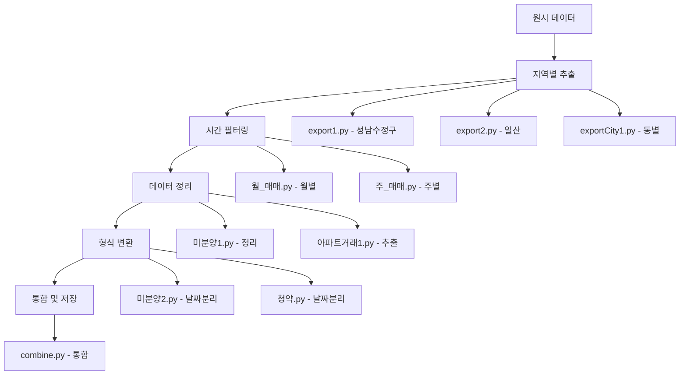

# Preprocessing Scripts Documentation

본 문서는 `/preprocessing` 디렉토리에 위치한 데이터 전처리 스크립트들에 대한 상세한 설명을 제공합니다. 이 스크립트들은 원시 데이터를 정제하고 분석에 적합한 형태로 변환하는 역할을 담당합니다.

## 📁 파일 개요

| 파일명 | 목적 | 주요 기능 |
|--------|------|-----------|
| `combine.py` | 지역별 데이터 통합 | 위례 지역 3개 CSV 파일 통합 |
| `export1.py` | 성남수정구 데이터 추출 | 특정 기간 데이터 필터링 |
| `export2.py` | 일산 지역 데이터 통합 | 일산동구/서구 데이터 통합 |
| `exportCity1.py` | 지역별 데이터 추출 | 동별 필터링 및 추출 |
| `exportCity2.py` | 도로명 기반 추출 | 도로명주소 기반 필터링 |
| `고용.py` | 고용 데이터 추출 | 특정 지역 취업자/고용률 추출 |
| `미분양1.py` | 미분양 데이터 정리 | 2013-2024 기간 데이터 정리 |
| `미분양2.py` | 미분양 데이터 변환 | 월별 컬럼 분리 |
| `아파트거래1.py` | 아파트거래 데이터 추출 | 거래현황 데이터 추출 |
| `아파트거래2.py` | 아파트매매 데이터 추출 | 매매거래현황 데이터 추출 |
| `월_매매.py` | 월별 가격지수 필터링 | 2013-2024 월별 데이터 |
| `주_매매.py` | 주별 가격지수 필터링 | 2013-2024 주별 데이터 |
| `지역내총생산.py` | GDP 데이터 추출 | 시도별 지역내총생산 추출 |
| `청약.py` | 청약 데이터 변환 | 날짜 컬럼 분리 |

---

## 🔧 상세 스크립트 분석

### 1. `combine.py` - 지역별 데이터 통합

**목적**: 위례 지역의 하남, 송파, 성남 3개 지역 CSV 파일을 하나로 통합

**주요 로직**:
```python
# 1. 세 개의 CSV 파일을 cp949 인코딩으로 읽기
df1 = pd.read_csv('result/위례_하남.csv', encoding='cp949')
df2 = pd.read_csv('result/위례_송파.csv', encoding='cp949')
df3 = pd.read_csv('result/위례_성남.csv', encoding='cp949')

# 2. 데이터프레임 통합
combined_df = pd.concat([df1, df2, df3], ignore_index=True)

# 3. NO 열 삭제 (불필요한 인덱스 컬럼)
if 'NO' in combined_df.columns:
    combined_df = combined_df.drop('NO', axis=1)

# 4. 시간순 정렬 (계약년월 → 계약일)
combined_df = combined_df.sort_values(['계약년월', '계약일'], ascending=[True, True])

# 5. 인덱스 재설정 및 저장
combined_df = combined_df.reset_index(drop=True)
combined_df.to_csv('result/위례_통합.csv', index=False, encoding='cp949')
```

**핵심 기능**:
- 다중 지역 데이터 통합
- 시간순 정렬
- 중복 인덱스 제거

---

### 2. `export1.py` - 성남수정구 위례 데이터 추출

**목적**: 성남수정구 위례 지역의 2013년 1월 이후 아파트 거래 데이터 추출

**주요 로직**:
```python
# 1. 필요한 컬럼 정의
columns_to_keep = ['NO', '시군구', '단지명', '도로명', '전용면적(㎡)', 
                   '계약년월', '계약일', '거래금액(만원)', '건축년도']

# 2. 데이터 로드 및 컬럼 선택
df = pd.read_csv(file_path, encoding='utf-8')
df_filtered = df[columns_to_keep].copy()

# 3. 시간 필터링 (2013년 1월 이후)
df_filtered = df_filtered[df_filtered['계약년월'] >= 201301]

# 4. 결측값 제거
df_filtered = df_filtered.dropna(subset=['계약년월'])

# 5. 결과 저장
df_filtered.to_csv(output_path, encoding='cp949', index=False)
```

**핵심 기능**:
- 특정 기간 데이터 필터링
- 필요 컬럼만 선택
- 결측값 처리

---

### 3. `export2.py` - 일산 지역 데이터 통합

**목적**: 일산동구와 일산서구 데이터를 통합하여 2013년 1월 이후 데이터 추출

**주요 로직**:
```python
# 1. 두 지역 파일 로드
df1 = pd.read_csv(file1_path, encoding='utf-8')  # 일산동구
df2 = pd.read_csv(file2_path, encoding='utf-8')  # 일산서구

# 2. 필요 컬럼 선택
df1_filtered = df1[columns_to_keep].copy()
df2_filtered = df2[columns_to_keep].copy()

# 3. 데이터 통합
combined_df = pd.concat([df1_filtered, df2_filtered], ignore_index=True)

# 4. 시간 필터링
combined_df = combined_df[combined_df['계약년월'] >= 201301]

# 5. 결과 저장
combined_df.to_csv(output_path, encoding='cp949', index=False)
```

**핵심 기능**:
- 다중 구역 데이터 통합
- 시간 필터링
- 인코딩 처리

---

### 4. `exportCity1.py` - 지역별 데이터 추출

**목적**: 특정 동(구래동, 마산동, 장기동, 운양동) 및 도로명('김포한강') 조건으로 데이터 추출

**주요 로직**:
```python
# 1. 데이터 로드
df = pd.read_csv(file_path, encoding='cp949')

# 2. 조건 설정
# 조건 1: 시군구에 특정 동 포함
condition1 = df.iloc[:, 1].str.contains('구래동|마산동|장기동|운양동', na=False)

# 조건 2: 도로명에 '김포한강' 포함
condition2 = df.iloc[:, 3].str.contains('김포한강', na=False)

# 3. AND 조건으로 필터링
filtered_df = df[condition1 & condition2].copy()

# 4. 결과 저장
filtered_df.to_csv(output_path, encoding='cp949', index=False)
```

**핵심 기능**:
- 다중 조건 필터링
- 정규표현식 패턴 매칭
- 지역별 세분화 추출

---

### 5. `exportCity2.py` - 도로명주소 기반 추출

**목적**: 도로명주소를 기반으로 특정 지역(판교, 김포한강) 아파트 데이터 추출

**주요 로직**:
```python
# 1. 통합 데이터 로드
df = pd.read_csv('result/도로명주소 추가/서울_경기_통합아파트_데이터_변환완료.csv', encoding='utf-8')

# 2. 추출 대상 법정동 정의
target_dongs = ['구래동', '마산동', '장기동', '운양동']

# 3. 조건 설정
# 조건 1: 법정동주소에 대상 동 포함
condition1 = df['법정동주소'].str.contains('|'.join(target_dongs), na=False)

# 조건 2: 도로명주소에 '김포한강' 포함
condition2 = df['도로명주소'].str.contains('김포한강', na=False)

# 4. AND 조건 필터링 및 저장
filtered_df = df[condition1 & condition2]
filtered_df.to_csv('result/판교지역_아파트_데이터.csv', index=False, encoding='cp949')
```

**핵심 기능**:
- 주소 기반 필터링
- 다중 조건 결합
- 지역 특화 추출

---

### 6. `고용.py` - 고용 데이터 추출

**목적**: 특정 지역(서울 송파구, 하남시, 성남시, 김포시, 고양시)의 취업자 및 고용률 데이터 추출

**주요 로직**:
```python
def extract_specific_regions_employment_data(input_file, output_file, target_regions):
    # 1. 다양한 인코딩으로 파일 읽기 시도
    for encoding in ['euc-kr', 'cp949', 'utf-8']:
        try:
            df = pd.read_csv(input_file, encoding=encoding)
            break
        except UnicodeDecodeError:
            continue
    
    # 2. 지역명 변형 패턴 생성
    target_regions_variations = []
    for target in target_regions:
        target_regions_variations.append(target)
        # 지역명 변형 추가 (예: '서울 송파구' → ['송파구', '서울송파구', '서울특별시 송파구'])
        if target == '서울 송파구':
            target_regions_variations.extend(['송파구', '서울송파구', '서울특별시 송파구'])
        # ... 기타 지역 변형
    
    # 3. 매칭되는 행 찾기
    matched_rows = pd.DataFrame()
    for target_variation in target_regions_variations:
        # 정확 일치
        exact_match = df[df[region_column] == target_variation]
        if not exact_match.empty:
            matched_rows = pd.concat([matched_rows, exact_match], ignore_index=True)
        else:
            # 부분 일치
            partial_match = df[df[region_column].str.contains(target_variation, na=False)]
            if not partial_match.empty:
                matched_rows = pd.concat([matched_rows, partial_match], ignore_index=True)
    
    # 4. 중복 제거 및 저장
    matched_rows = matched_rows.drop_duplicates()
    matched_rows.to_csv(output_file, index=False, encoding='utf-8-sig')
```

**핵심 기능**:
- 다중 지역 매칭
- 지역명 변형 처리
- 정확/부분 일치 검색
- 중복 제거

---

### 7. `미분양1.py` - 미분양주택현황 데이터 정리

**목적**: 2013년 1월부터 2024년 12월까지의 미분양주택현황 데이터를 정리하고 시간순으로 정렬

**주요 로직**:
```python
def process_unsold_housing_data(input_file, output_file):
    # 1. 파일 읽기 (다양한 인코딩 시도)
    for encoding in ['euc-kr', 'cp949', 'utf-8']:
        try:
            df = pd.read_csv(input_file, encoding=encoding)
            break
        except UnicodeDecodeError:
            continue
    
    # 2. 시작/종료 컬럼 인덱스 찾기
    start_2013_index = None
    end_2024_index = None
    for i, col in enumerate(columns):
        if '2013년 1월' in str(col):
            start_2013_index = i
        if '2024년 12월' in str(col):
            end_2024_index = i
    
    # 3. 필요한 컬럼 선택 (기본 컬럼 + 날짜 범위)
    base_columns = columns[:3]  # No, 분류1, 분류2
    selected_columns = base_columns + columns[end_2024_index:start_2013_index + 1]
    filtered_df = df[selected_columns].copy()
    
    # 4. 데이터 정리 (따옴표 제거, 숫자 변환)
    date_columns = selected_columns[3:]
    for col in date_columns:
        # 문자열 정리
        filtered_df[col] = filtered_df[col].astype(str)
        filtered_df[col] = filtered_df[col].str.replace('"""', '').str.replace(',', '')
        filtered_df[col] = filtered_df[col].replace(['', 'nan', 'None'], '0')
        
        # 숫자 변환
        filtered_df[col] = pd.to_numeric(filtered_df[col], errors='coerce').fillna(0).astype(int)
    
    # 5. 시간순 정렬 (역순을 정순으로)
    date_columns_reversed = date_columns[::-1]
    final_columns = base_columns + date_columns_reversed
    final_df = filtered_df[final_columns].copy()
    
    # 6. 저장
    final_df.to_csv(output_file, index=False, encoding='euc-kr')
```

**핵심 기능**:
- 시간 범위 필터링
- 데이터 타입 변환
- 시간순 정렬
- 문자열 정리

---

### 8. `미분양2.py` - 미분양 데이터 월별 컬럼 분리

**목적**: '월(Monthly)' 컬럼을 '연도'와 '월' 두 개의 컬럼으로 분리

**주요 로직**:
```python
def split_monthly_column():
    # 1. 월 이름 매핑
    month_mapping = {
        'Jan': 1, 'Feb': 2, 'Mar': 3, 'Apr': 4, 'May': 5, 'Jun': 6,
        'Jul': 7, 'Aug': 8, 'Sep': 9, 'Oct': 10, 'Nov': 11, 'Dec': 12
    }
    
    # 2. 데이터 로드
    df = pd.read_csv('전국_미분양주택현황.csv', encoding='utf-8')
    
    # 3. 형태 판별 및 파싱
    sample_value = df['월(Monthly)'].iloc[0]
    
    if '-' in sample_value:
        parts = sample_value.split('-')
        
        # YYYY-MM 형태
        if len(parts[0]) == 4 and parts[0].isdigit():
            df['연도'] = df['월(Monthly)'].str[:4].astype(int)
            df['월'] = df['월(Monthly)'].str[5:7].astype(int)
        
        # Mon-YY 형태 (예: Jan-13)
        elif parts[0] in month_mapping:
            def parse_monthly(monthly_str):
                month_str, year_str = monthly_str.split('-')
                month_num = month_mapping[month_str]
                
                # 2자리 연도를 4자리로 변환
                year_num = int(year_str)
                if year_num < 50:
                    year_num += 2000
                else:
                    year_num += 1900
                
                return year_num, month_num
            
            parsed_data = df['월(Monthly)'].apply(parse_monthly)
            df['연도'] = [x[0] for x in parsed_data]
            df['월'] = [x[1] for x in parsed_data]
    
    # 4. 컬럼 재정렬 및 정렬
    df_final = df[['연도', '월', '구분', '시군구', '미분양현황']].copy()
    df_final = df_final.sort_values(['연도', '월', '구분', '시군구'])
    
    # 5. 저장
    df_final.to_csv(output_file, index=False, encoding='utf-8-sig')
```

**핵심 기능**:
- 날짜 형식 자동 감지
- 다양한 날짜 패턴 처리
- 2자리 연도 4자리 변환
- 시간순 정렬

---

### 9. `아파트거래1.py` - 아파트거래현황 데이터 추출

**목적**: 2013년 1월부터 2024년 12월까지의 아파트거래현황에서 '동(호)수' 데이터만 추출

**주요 로직**:
```python
def extract_apartment_data(input_file, output_file):
    # 1. 다양한 인코딩으로 파일 읽기
    for encoding in ['cp949', 'euc-kr', 'utf-8']:
        try:
            df = pd.read_csv(input_file, encoding=encoding, header=None)
            break
        except:
            continue
    
    # 2. 시간 범위 찾기
    header_row = df.iloc[0]  # 헤더 행
    start_col_idx = None
    end_col_idx = None
    
    for i, col_name in enumerate(header_row):
        if '2013' in str(col_name) and '1' in str(col_name):
            start_col_idx = i
        if '2024' in str(col_name) and '12' in str(col_name):
            end_col_idx = i
    
    # 3. '동(호)수' 패턴 컬럼 찾기
    second_row = df.iloc[1]  # 2번째 행
    dong_ho_cols = []
    
    for col_idx in range(start_col_idx, end_col_idx + 1):
        if col_idx < len(second_row):
            cell_value = str(second_row.iloc[col_idx])
            if '동' in cell_value and ('호' in cell_value or '수' in cell_value):
                dong_ho_cols.append(col_idx)
    
    # 4. 최종 컬럼 선택 (A,B,C,D + 동(호)수 컬럼들)
    basic_cols = [0, 1, 2, 3]
    final_cols = basic_cols + dong_ho_cols
    extracted_df = df.iloc[:, final_cols].copy()
    
    # 5. 숫자 데이터 정리
    extracted_df = clean_numeric_data(extracted_df, basic_cols)
    
    # 6. 저장
    extracted_df.to_csv(output_file, index=False, header=False, encoding='utf-8-sig')

def clean_numeric_data(df, basic_cols):
    # 4행부터의 데이터만 숫자 변환 (헤더 보존)
    numeric_col_indices = [col for col in range(len(df.columns)) if col not in basic_cols]
    
    for col_idx in numeric_col_indices:
        col_name = df.columns[col_idx]
        data_rows = df.loc[3:, col_name].copy()  # 4행부터
        
        # 문자열 정리
        data_rows = data_rows.astype(str)
        data_rows = data_rows.str.replace('"""', '').str.replace(',', '')
        data_rows = data_rows.replace(['', 'nan'], '0')
        
        # 숫자 변환
        data_rows = pd.to_numeric(data_rows, errors='coerce').fillna(0).astype(int)
        df.loc[3:, col_name] = data_rows
```

**핵심 기능**:
- 동적 컬럼 탐지
- 패턴 기반 필터링
- 헤더 보존 데이터 변환
- 대용량 데이터 처리

---

### 10. `아파트거래2.py` - 아파트매매거래현황 데이터 추출

**목적**: 아파트매매거래현황에서 2013-2024년 기간의 '동(호)수' 데이터 추출

**주요 로직**:
```python
def extract_apartment_trade_data(input_file, output_file):
    # 1. 파일 로드
    for encoding in ['euc-kr', 'cp949', 'utf-8']:
        try:
            df = pd.read_csv(input_file, encoding=encoding, header=None)
            break
        except:
            continue
    
    # 2. 정확한 컬럼 위치 찾기
    header_row = df.iloc[0]
    start_col_idx = None
    end_col_idx = None
    
    for i, col_name in enumerate(header_row):
        if pd.notna(col_name) and str(col_name).strip() == '2013년 1월':
            start_col_idx = i
        if pd.notna(col_name) and str(col_name).strip() == '2024년 12월':
            end_col_idx = i
    
    # 수동 설정 (분석 결과 기반)
    if start_col_idx is None or end_col_idx is None:
        start_col_idx = 172  # 2013년 1월
        end_col_idx = 459    # 2024년 12월
    
    # 3. '동(호)수' 패턴 탐지
    second_row = df.iloc[1]
    dong_ho_cols = []
    
    for col_idx in range(start_col_idx, end_col_idx + 1):
        if col_idx < len(second_row):
            cell_value = second_row.iloc[col_idx]
            if pd.notna(cell_value):
                cell_str = str(cell_value)
                if '동' in cell_str and ('호' in cell_str or '수' in cell_str):
                    dong_ho_cols.append(col_idx)
    
    # 4. 데이터 추출 및 정리
    basic_cols = [0, 1, 2, 3]
    final_cols = basic_cols + dong_ho_cols
    extracted_df = df.iloc[:, final_cols].copy()
    cleaned_df = clean_numeric_data(extracted_df, basic_cols)
    
    # 5. 저장
    cleaned_df.to_csv(output_file, index=False, header=False, encoding='utf-8-sig')
```

**핵심 기능**:
- 정확한 시점 탐지
- 매매 특화 데이터 추출
- 대용량 파일 처리
- 메모리 효율적 처리

---

### 11. `월_매매.py` - 월별 매매가격지수 필터링

**목적**: 2013년 1월부터 2024년 12월까지의 월별 매매가격지수 원자료만 추출

**주요 로직**:
```python
def filter_monthly_apartment_price_data(input_file, output_file):
    # 1. 데이터 로드
    try:
        df = pd.read_csv(input_file, encoding='euc-kr')
    except UnicodeDecodeError:
        df = pd.read_csv(input_file, encoding='utf-8')
    
    # 2. 컬럼 인덱스 계산
    # 구조: 5개 기본컬럼 + 2003년11월부터 각 월마다 2개컬럼(원자료, 전기대비증감률)
    start_index = 5  # 기본 컬럼
    start_index += 2 * 2  # 2003년 11-12월
    start_index += 9 * 12 * 2  # 2004-2012년
    # start_index = 225 (2013년 1월 원자료)
    
    end_index = start_index + (12 * 12 * 2) - 2  # 2024년 12월 원자료
    
    # 3. 기본 컬럼 + 원자료만 선택
    base_columns = df.columns[:5].tolist()
    selected_columns = base_columns.copy()
    
    # 원자료 컬럼만 선택 (홀수 인덱스에서 시작하여 2씩 증가)
    for i in range(start_index, end_index + 1, 2):
        if i < len(df.columns):
            selected_columns.append(df.columns[i])
    
    # 4. 필터링 및 저장
    filtered_df = df[selected_columns].copy()
    filtered_df.to_csv(output_file, index=False, encoding='utf-8-sig')
```

**핵심 기능**:
- 정확한 시간 범위 계산
- 원자료/증감률 분리
- 월별 데이터 추출
- 컬럼 패턴 인식

---

### 12. `주_매매.py` - 주별 매매가격지수 필터링

**목적**: 2013-01-07부터 2024-12-30까지의 주별 매매가격지수 원자료 추출

**주요 로직**:
```python
def filter_housing_price_data(input_file, output_file):
    # 1. 데이터 로드
    try:
        df = pd.read_csv(input_file, encoding='euc-kr')
    except UnicodeDecodeError:
        df = pd.read_csv(input_file, encoding='utf-8')
    
    # 2. 시작/종료 컬럼 찾기
    start_index = None
    end_index = None
    
    for i, col in enumerate(df.columns):
        if col == '2013-01-07':
            start_index = i
        if col == '2024-12-30':
            end_index = i
    
    # 3. 기본 컬럼 + 원자료만 선택
    base_columns = df.columns[:5].tolist()  # No, 분류1~4
    selected_columns = base_columns.copy()
    
    # 홀수 인덱스만 선택 (원자료)
    for i in range(start_index, end_index + 1, 2):
        if i < len(df.columns):
            selected_columns.append(df.columns[i])
    
    # 4. 필터링 및 저장
    filtered_df = df[selected_columns].copy()
    filtered_df.to_csv(output_file, index=False, encoding='utf-8-sig')
```

**핵심 기능**:
- 주별 데이터 처리
- 정확한 날짜 매칭
- 원자료 추출
- 고빈도 데이터 처리

---

### 13. `지역내총생산.py` - 지역내총생산 데이터 추출

**목적**: 2013년 이후 시도별 지역내총생산(시장가격) 데이터 추출

**주요 로직**:
```python
def extract_gdp_from_2013():
    # 1. 데이터 로드
    try:
        df = pd.read_csv('시도별 지역내총생산.csv', encoding='euc-kr')
    except UnicodeDecodeError:
        df = pd.read_csv('시도별 지역내총생산.csv', encoding='cp949')
    
    # 2. 기본 컬럼 추출
    basic_columns = df.columns[:4].tolist()  # 시도별, 경제활동별, 항목, 단위
    
    # 3. 2013년 이후 연도 컬럼 찾기
    year_columns = []
    for col in df.columns:
        if any(year in str(col) for year in ['2013', '2014', '2015', '2016', 
                                           '2017', '2018', '2019', '2020', 
                                           '2021', '2022', '2023']):
            year_columns.append(col)
    
    # 4. 컬럼 선택 및 필터링
    selected_columns = basic_columns + year_columns
    df_extracted = df[selected_columns].copy()
    
    # 5. '지역내총생산(시장가격)'만 필터링
    df_extracted = df_extracted[df_extracted['경제활동별'] == '지역내총생산(시장가격)'].copy()
    
    # 6. 빈 컬럼 제거 및 저장
    df_extracted = df_extracted.dropna(axis=1, how='all')
    df_extracted.to_csv(output_file, index=False, encoding='utf-8-sig')
```

**핵심 기능**:
- 특정 지표 필터링
- 연도별 데이터 추출
- 지역별 경제지표 처리
- 빈 컬럼 정리

---

### 14. `청약.py` - 청약 경쟁률 데이터 날짜 분리

**목적**: 연월 컬럼을 연도와 월로 분리하여 시계열 분석 준비

**주요 로직**:
```python
def split_date_column(input_file, output_file):
    # 1. 데이터 로드 (다양한 인코딩 시도)
    for encoding in ['utf-8', 'cp949', 'euc-kr']:
        try:
            df = pd.read_csv(input_file, encoding=encoding)
            break
        except UnicodeDecodeError:
            continue
    
    # 2. 연월 컬럼 찾기
    date_column = None
    for col in df.columns:
        if '연월' in col or '¿¬¿ù' in col:
            date_column = col
            break
    
    # 3. 날짜 파싱 함수
    def parse_date(date_str):
        if pd.isna(date_str):
            return None, None
        
        date_str = str(date_str).strip()
        
        # YYYY-MM 형식
        if re.match(r'^\d{4}-\d{2}$', date_str):
            year, month = date_str.split('-')
            return int(year), int(month)
        
        # MMM-YY 형식 (예: Feb-23)
        elif re.match(r'^[A-Za-z]{3}-\d{2}$', date_str):
            month_str, year_str = date_str.split('-')
            
            month_map = {'Jan': 1, 'Feb': 2, 'Mar': 3, 'Apr': 4,
                        'May': 5, 'Jun': 6, 'Jul': 7, 'Aug': 8,
                        'Sep': 9, 'Oct': 10, 'Nov': 11, 'Dec': 12}
            
            month = month_map.get(month_str.capitalize(), None)
            year = int('20' + year_str) if int(year_str) < 50 else int('19' + year_str)
            
            return year, month
        
        # MM-YYYY 형식
        elif re.match(r'^\d{2}-\d{4}$', date_str):
            month, year = date_str.split('-')
            return int(year), int(month)
    
    # 4. 연도, 월 컬럼 생성
    df[['연도', '월']] = df[date_column].apply(lambda x: pd.Series(parse_date(x)))
    
    # 5. 컬럼 재정렬 및 저장
    columns = ['연도', '월'] + [col for col in df.columns if col not in ['연도', '월', date_column]]
    df_new = df[columns].copy()
    df_new.to_csv(output_file, index=False, encoding='utf-8-sig')
```

**핵심 기능**:
- 다양한 날짜 형식 처리
- 정규표현식 패턴 매칭
- 2자리 연도 변환
- 컬럼 재구성

---

## 🔄 데이터 처리 흐름



## 📝 처리 결과

각 스크립트는 다음과 같은 표준화된 결과를 생성합니다:

- **인코딩**: UTF-8 또는 CP949
- **날짜 형식**: 표준화된 연도/월 컬럼
- **데이터 타입**: 적절한 숫자/문자열 타입
- **결측값**: 처리된 상태
- **정렬**: 시간순 정렬
- **컬럼명**: 일관된 명명 규칙

## 🛠 주요 기술적 특징

1. **강건한 인코딩 처리**: 다양한 인코딩 자동 감지 및 처리
2. **동적 컬럼 탐지**: 파일 구조 자동 분석
3. **패턴 기반 필터링**: 정규표현식을 활용한 유연한 데이터 추출
4. **메모리 효율성**: 대용량 파일 처리 최적화
5. **오류 처리**: 예외 상황 대응 및 대안 방법 제공

이러한 전처리 스크립트들은 후속 분석 파이프라인(`script/` 디렉토리)의 입력 데이터를 표준화된 형태로 제공하는 역할을 담당합니다. 